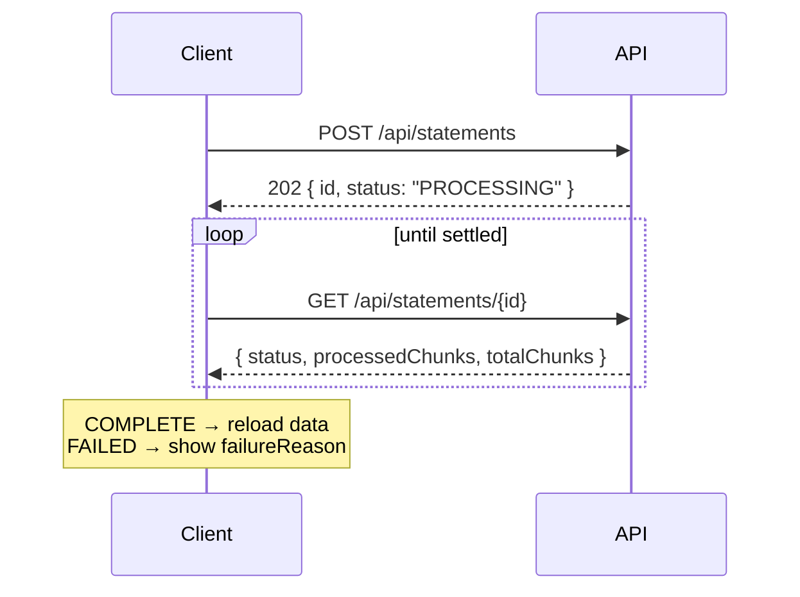

# API overview

REST over JSON. Every endpoint is under `/api`, and every one except the auth endpoints
requires a bearer token.

## Base URLs

| Environment | URL |
| --- | --- |
| Production | `https://finme-backend.azurewebsites.net` |
| Local | `http://localhost:8080` |

## Interactive documentation

OpenAPI is generated from the controllers, so it cannot drift from the implementation:

- **Local**: <http://localhost:8080/swagger-ui.html>
- **Spec**: `/v3/api-docs`

Use Swagger UI for exact request and response schemas. This section covers the conventions
that apply across all of them.

## Conventions

**Content type** is `application/json`, except file uploads, which are `multipart/form-data`.

**Authentication** is `Authorization: Bearer <jwt>` — see
[Authentication](/api/authentication).

**No user id in requests.** The current user is resolved from the token. An endpoint that
accepted a user id would be an authorisation hole by construction.

**404 rather than 403** for another user's resource. From that user's perspective it does not
exist, and distinguishing the two leaks that it does.

**Dates** are ISO `yyyy-MM-dd`. Timestamps are ISO-8601 instants. Formatting for display is
the client's job.

**Money** is a JSON number with two decimal places, in rands.

## Status codes

| Code | Meaning |
| --- | --- |
| `200` | Success |
| `201` | Created — a resource now exists |
| `202` | Accepted — work is queued, poll for the outcome |
| `400` | Validation or bad input |
| `401` | Missing, invalid or expired token |
| `403` | Authenticated but not permitted |
| `404` | Not found, or not yours |
| `413` | Upload too large |
| `500` | Unhandled server error |

`202` is not decorative. Statement and receipt uploads return it because extraction happens
after the response — [ADR-004](/decisions/ADR-004-asynchronous-ingestion).

## Endpoints

### Auth — `/api/auth`

| Method | Path | Purpose |
| --- | --- | --- |
| `POST` | `/register` | Create an account |
| `POST` | `/login` | Exchange credentials for a JWT |
| `GET` | `/verify-email` | Verify from an emailed link |
| `POST` | `/resend-verification` | Reissue the verification email |

### Transactions — `/api/transactions`

| Method | Path | Purpose |
| --- | --- | --- |
| `GET` | `/` | List, with optional `from`, `to` and other filters |
| `POST` | `/manual` | Log a cash transaction from natural language |
| `PUT` | `/{id}` | Correct a transaction |
| `DELETE` | `/{id}` | Delete a transaction |

### Statements — `/api/statements`

| Method | Path | Purpose |
| --- | --- | --- |
| `POST` | `/` | Upload a PDF → `202` |
| `GET` | `/{id}` | Poll status and progress |

### Receipts — `/api/receipts`

| Method | Path | Purpose |
| --- | --- | --- |
| `POST` | `/` | Upload a JPEG or PNG → `202` |
| `GET` | `/{id}` | Poll status |

### Dashboard — `/api/dashboard`

| Method | Path | Purpose |
| --- | --- | --- |
| `GET` | `/summary` | Totals, category breakdown, trend |
| `GET` | `/recommendations` | AI commentary |
| `GET` | `/calendar` | Per-day totals for a month |

### Budgets — `/api/budgets`

| Method | Path | Purpose |
| --- | --- | --- |
| `GET` | `/` | Budgets with spend and remaining |
| `POST` | `/` | Create or update a budget |
| `DELETE` | `/{id}` | Remove a budget |

### Credit — `/api/credit`

| Method | Path | Purpose |
| --- | --- | --- |
| `POST` `GET` `DELETE` | `/profile` | Manage the credit profile |
| `POST` | `/accounts` | Add an account |
| `PUT` `DELETE` | `/accounts/{id}` | Update or remove an account |
| `POST` | `/score` | Record a score reading |
| `GET` | `/score/history` | Recorded scores over time |
| `GET` | `/score/comparison` | Current against previous |
| `GET` | `/analysis` | Utilisation and improvement plan |
| `POST` | `/simulate` | Model a balance change |

### User — `/api/users`

| Method | Path | Purpose |
| --- | --- | --- |
| `PUT` | `/me` | Update display name |
| `DELETE` | `/me/data` | Delete all data, keep the account |
| `DELETE` | `/me` | Delete the account |

Both deletions require the account email in the body as confirmation. Neither is reversible.

## Upload polling

A `FAILED` response carries `failureReason`. Show it — the upload response could not carry the
reason, so this is the only place the user learns what went wrong.

## Rate limits

None imposed by this API. The AI providers behind it have their own, which is what the
fallback chain exists to absorb —
[ADR-001](/decisions/ADR-001-ai-provider-fallback-chain).
