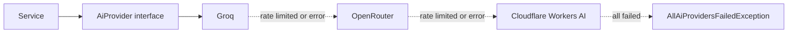

# ADR-001: AI provider fallback chain

**Status:** Accepted
**Date:** 2026-08

## Context

Extraction depends on an LLM: turning statement text into structured transactions, reading a
receipt photo, categorising, and narrating the dashboard.

Three constraints shaped the choice:

**Budget is zero.** A solo student project on free tiers. Paid per-token pricing was never an
option.

**Free tiers rate-limit aggressively.** A single provider will refuse requests during a
multi-chunk statement extraction — not an edge case, the normal path.

**Users upload bank statements.** Whatever provider sees this data must not retain it, and the
project should not depend on trusting that promise alone.

## Decision

A chain of three providers, tried in order, each on its own free tier:

Services depend on the interface, never on a provider. Ordering and models are configuration.

**Order is by latency.** Groq is first because it is markedly faster; the others are capacity
behind it, not equals.

**Gemini is excluded from production entirely**, on any tier, regardless of whether a key is
configured. It stays available for development work on generic content with no user data in
the prompt.

**All three are configured for zero or minimal retention**, and redaction runs before any of
them sees anything — [ADR-002](/decisions/ADR-002-redaction-before-ai-calls).

## Alternatives considered

**One provider.** Simplest, and fails the moment that provider rate-limits. On a free tier
that is routine, not exceptional — a single 429 mid-statement would abandon an extraction the
user was waiting on.

**A paid provider.** Removes the rate-limit problem and the budget with it. Out of scope.

**A local model.** No hosting cost per call, but needs hardware the free App Service tier does
not have, and the quality gap on structured extraction is real.

**An abstraction library.** LangChain or similar would supply the chain. Rejected: the
abstraction is roughly the size of the code it replaces here, and it adds a dependency between
the application and every provider quirk — of which there were several real ones, below.

## Consequences

**Good.** One provider's rate limit is invisible to users. Adding or reordering providers is
configuration. Costs nothing. `MockAiProvider` makes local development instant and
deterministic.

**Bad.** Three provider integrations to maintain, each with its own quirks. Output quality
varies across the chain, so the same statement can extract slightly differently depending on
who answered. When all three fail there is no fallback left, and the failure surfaces to the
user as a recorded reason.

**Quirks found by actually calling them,** not from documentation:

- Cloudflare Workers AI needs a `prompt` field where the others take `messages`
- Cloudflare's `result.response` is an object, not a string
- Free-tier model availability on OpenRouter changes without notice, which is why the model is
  configurable rather than hardcoded

These are the sort of thing that makes a generic abstraction leak, and they justify the
hand-rolled chain more than any design argument did.

## Measurement

The chain makes "which provider answered" invisible to the caller, which would make quality
drift invisible too. The evaluation harness exists to prevent that: precision, recall and
hallucination rate against a labelled golden set, per pipeline.

That measurement is the project's actual differentiator. Without it, "the AI reads your
statement" is a claim rather than a number.
