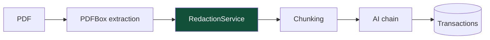

# ADR-002: Redaction before any external AI call

**Status:** Accepted
**Date:** 2026-08

## Context

Bank statements contain more than transactions: account numbers, ID numbers, the account
holder's name and address. Extraction requires sending statement text to a third-party
provider.

Provider retention settings exist and are configured, but they are a promise made by someone
else, enforced on their infrastructure, verifiable only by trusting them. For financial
documents that is not a sufficient control on its own.

## Decision

**Account numbers, ID numbers and personal names are stripped before any data reaches an
external AI provider.** Independent of, and in addition to, provider-side retention settings.

Redaction is a **pipeline step**, not a provider setting:

Its position is the point. It sits between extraction and the chain, so no provider path can
bypass it — adding a fourth provider tomorrow inherits redaction automatically, because the
provider never sees unredacted text in the first place.

## Why not rely on provider settings

Every provider in the chain is configured for zero or minimal retention, and that is worth
doing. It is not sufficient:

- It is unverifiable from outside
- It can change with a terms update
- A misconfiguration is silent — nothing in the response says "this was retained"
- It protects nothing in transit or in provider logs

Redaction fails closed instead. Data that never left cannot be retained.

## What is removed

Account numbers, ID numbers and personal names. The transaction fields that survive — date,
merchant, amount, description, payment method — are what extraction actually needs. The
redacted text is still fully sufficient for the model's job, which is why this costs nothing in
quality.

## The receipt gap {#the-receipt-gap}

**Receipt photos are sent to a vision model unredacted.** This is the one exception, and it is
deliberate, documented and risk-accepted rather than overlooked.

A photograph has no text layer. There is nothing to run a text redactor over — the sensitive
content, if any, is pixels. Redacting it would mean OCR, then locating the sensitive regions,
then masking them, then sending the image: a pipeline as error-prone as the one it protects,
where a miss is silent.

What limits the exposure:

- A till slip carries far less identifying data than a bank statement — usually a merchant, a
  date, line items, and possibly the last four digits of a card
- The image is not stored; it is processed and discarded
- Vision providers are the same zero-retention set

It remains the only path in the application that sends raw external input to a provider, and
it is named as such in the code so nobody mistakes it for an oversight.

## Alternatives considered

**Rely on provider retention settings alone.** Rejected above.

**Redact inside each provider implementation.** Three copies of the same logic, and a fourth
provider silently arrives without it. The failure mode is a leak that nothing catches.

**Send only pre-parsed fields, never raw text.** Would remove the need for redaction — but
parsing a statement into fields is precisely the job the model is being asked to do. This is
circular.

**Run a local model.** No external call, no redaction needed. Rejected in
[ADR-001](/decisions/ADR-001-ai-provider-fallback-chain) on hosting and quality grounds.

## Consequences

**Good.** No account or ID number leaves the system. The guarantee holds regardless of
provider behaviour or configuration drift. New providers inherit it structurally.

**Bad.** Merchant names occasionally resemble personal names, so redaction can over-strip and
lose a little context. Accepted deliberately: over-redaction degrades a category guess,
under-redaction leaks an ID number. Those are not symmetric.

**Testing.** Redaction is tested directly rather than only through the pipeline, because a
regression here is silent — nothing fails, data simply leaves that should not have.
