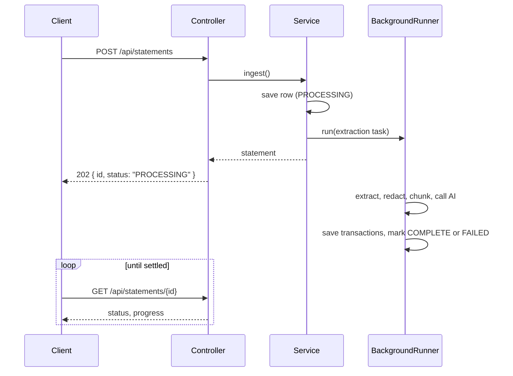

# ADR-004: Asynchronous document ingestion

**Status:** Accepted
**Date:** 2026-08 (statements), 2026-09 (receipts)

## Context

Extraction is slow and the duration is not under the application's control:

- A multi-page statement is split into chunks, each a separate AI call
- Chunks are paced around provider rate limits
- A provider may fail and the chain falls through to the next
- A large statement can take minutes

The obvious implementation — do the work, then respond — means holding an HTTP request open
for that entire time.

## Decision

**Uploads return `202 Accepted` immediately and the client polls for the outcome.**



Statements worked this way from the start. **Receipts did not** — they ran the vision call
inline and returned `201` only once the provider answered. That was an inconsistency, not a
design, and was corrected in 2026-09.

## Why not just hold the request

**Proxies time out.** Azure App Service, and most infrastructure in between, will cut a
long-running request regardless of what the application intends.

**The browser gives no useful feedback.** A spinner for three minutes is indistinguishable
from a hang.

**A dropped connection loses the work.** Synchronously, closing the tab abandons the
extraction. Asynchronously it completes anyway, so "check back shortly" is a genuine promise:
the statement will be there next time the dashboard is opened.

**No progress is possible.** A single response cannot report that chunk 3 of 7 is done.

## Consequences

### Failures are recorded, not thrown

The significant consequence, and the one that drove a schema change.

Once work runs on a thread nobody is waiting on, a thrown exception has nowhere to go — the
executor swallows it. So the outcome is written to the row:

```java
private Receipt fail(Receipt receipt, String reason) {
    receipt.setStatus(ReceiptStatus.FAILED);
    receipt.setFailureReason(reason);
    return receiptRepository.save(receipt);
}
```

`Receipt` gained a `failure_reason` column for exactly this. It is the only way the user ever
learns why — the upload response was sent long before anything could fail.

### Clients must poll properly

`202` means *accepted*, not *succeeded*. A client that stops at the upload response shows
nothing and says nothing when extraction fails. Poll, check `status`, surface `failureReason`.

### Validation stays synchronous

File type and signature are checked **before** returning. They need no AI call, and a wrong
file is worth rejecting outright rather than reporting as a failed receipt the user has to go
find.

The dividing line: anything that can be decided instantly is decided in the request; anything
requiring an external call goes to the background.

### `@Async` needs a separate bean

```java
@Component
public class BackgroundRunner {
    @Async("statementExecutor")
    public void run(String description, Runnable task) { ... }
}
```

`@Async` is applied by a proxy, and a proxy only intercepts calls arriving from outside the
object. Had the ingestion service annotated its own method and called it internally, the
self-invocation would bypass the proxy and run inline — the upload would still block for the
full extraction, **with nothing in the code looking wrong**.

Taking a `Runnable` rather than depending on the ingestion service also keeps the dependency
one-directional, avoiding the circular reference a dedicated processor bean would create.

### Testing needs care

Mocking `BackgroundRunner` skips the work entirely and leaves the interesting assertions
testing nothing. A real executor makes them race. `InlineBackgroundRunner` runs the task on the
calling thread — deterministic, and the work actually happens.

For Spring integration tests where the real executor is in play, poll the row:

```java
private Receipt awaitReceiptSettled(Long receiptId) throws InterruptedException {
    long deadline = System.currentTimeMillis() + 30_000;
    while (System.currentTimeMillis() < deadline) {
        Receipt receipt = receiptRepository.findById(receiptId).orElseThrow();
        if (receipt.getStatus() != ReceiptStatus.PROCESSING) return receipt;
        Thread.sleep(50);
    }
    throw new AssertionError("still PROCESSING after 30s");
}
```

## Alternatives considered

**A job queue.** Correct at scale, and overkill here — it needs infrastructure the free tier
does not have, for a workload of one user's uploads.

**WebSockets or SSE for progress.** Removes polling, adds a connection to manage and a
reconnection story. Polling every 1.5–2 seconds is adequate for a job measured in minutes.

**Client-side chunking.** Would move pacing to the browser and put provider keys where the
client can see them. Not viable.
