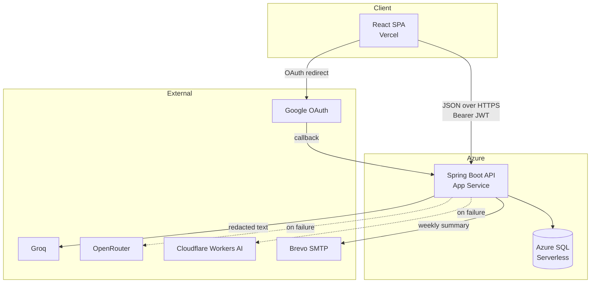
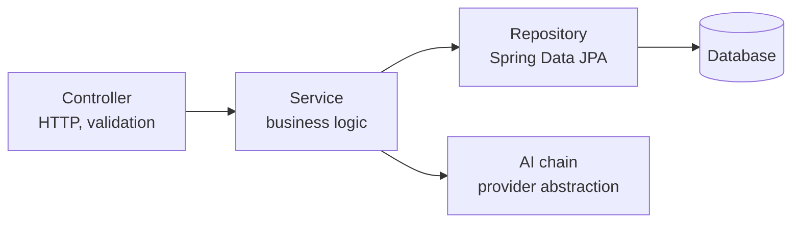
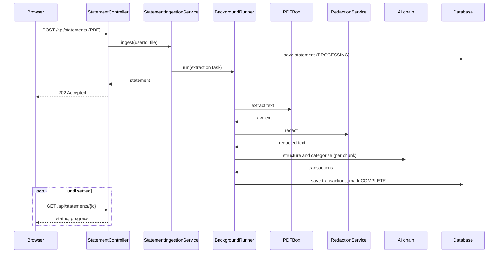
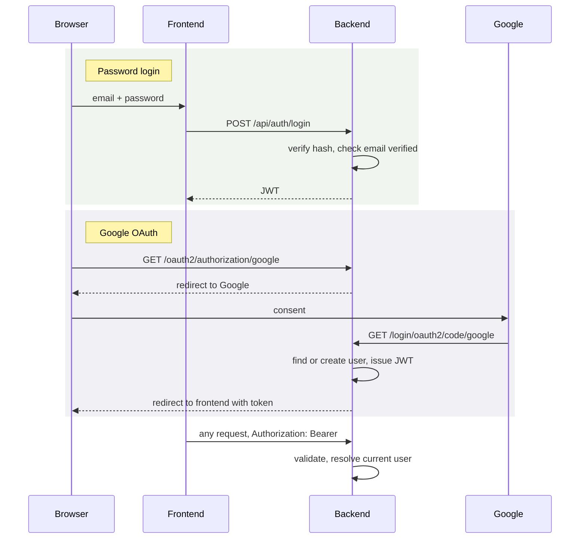
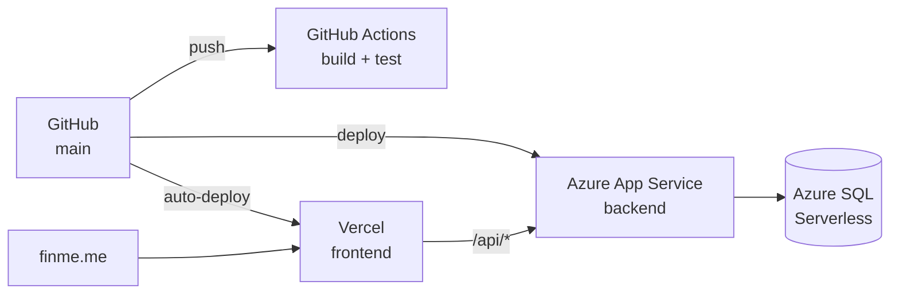

# Architecture

## System shape

A single-page React client talking to a stateless Spring Boot API over JSON, with a relational
database and three external AI providers behind a fallback chain.

The client holds no secrets and makes no direct call to any provider. Every external call
originates from the backend, which is what makes redaction enforceable in one place.

## Backend layering

Conventional four layers, with one addition that matters:

Controllers do HTTP concerns only — bind, validate, delegate, map to a response. They contain
no business logic, which is why the service layer can be tested without standing up a web
context.

The AI chain sits behind an interface (`AiProvider`, `VisionAiProvider`) so services depend on
the capability, not on any provider. Swapping or reordering providers touches configuration,
not service code.

## Statement ingestion

The most involved flow in the system, and the one whose design decisions are least obvious.

Three things in that diagram are deliberate:

**The 202 and the poll.** Extraction is paced by provider rate limits and can take minutes on
a large statement. Holding an HTTP request open for that is not workable —
[ADR-004](/decisions/ADR-004-asynchronous-ingestion).

**Redaction sits between extraction and the AI call**, not inside the provider and not
optional. It is a step in the pipeline, so no provider path can bypass it —
[ADR-002](/decisions/ADR-002-redaction-before-ai-calls).

**Chunking before the AI call.** Statements are split into chunks sized around provider rate
limits. The chunk count drives the progress percentage the client polls, which is why it is
reported at all.

## Receipt ingestion

Structurally the same, minus the local extraction step — a photograph has no text layer, so
the image goes to a vision model directly.

That makes this the only path in the application that sends raw external input to a provider
unfiltered. It is a known, accepted gap rather than an oversight, documented in
[ADR-002](/decisions/ADR-002-redaction-before-ai-calls#the-receipt-gap).

## Authentication

Two entry paths converge on one JWT scheme.

The OAuth success handler issues the *same* JWT the password path issues. Downstream, nothing
knows or cares how a user signed in — there is one authentication scheme, not two.

Google's callback points at the **backend**, not the frontend. Spring Security handles the
code exchange and then redirects the browser onward with a token. See
[Authentication](/api/authentication).

## Data isolation

Every user-scoped query filters on the user id resolved from the JWT, at the repository call.
Not in the controller, not in the UI. A request for another user's resource returns 404 rather
than 403 — the resource is not merely forbidden, it does not exist as far as that user is
concerned.

## Deployment topology

Details and the cost constraints that shaped this in [Deployment](/operations/deployment).

## Technology choices

| Layer | Choice | Why |
| --- | --- | --- |
| Backend | Spring Boot 4, Java 21 | Existing depth; the ecosystem covers security, JPA and scheduling without bolt-ons |
| Frontend | React 19 + TypeScript + Vite | Types matter on money-handling code; Vite for build speed |
| Database | Azure SQL Serverless (H2 locally) | [ADR-005](/decisions/ADR-005-azure-sql-over-mysql) |
| PDF text | Apache PDFBox | Local extraction — no document leaves the server before redaction |
| AI | Groq → OpenRouter → Cloudflare | [ADR-001](/decisions/ADR-001-ai-provider-fallback-chain) |
| Auth | JWT + Spring Security OAuth2 | Stateless, so the API scales without session affinity |
| Tests | JUnit 5 + Playwright | Real browser for layout; jsdom cannot measure |
