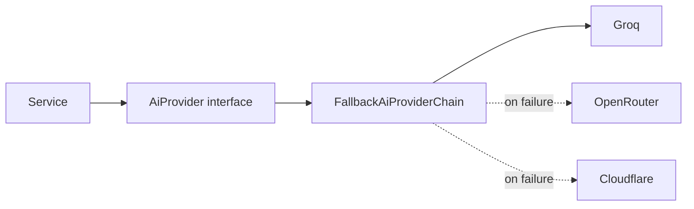

# Backend

Spring Boot 4 on Java 21. `backend/`, package root `com.finme.backend`.

## Package layout

| Package | Holds | Depends on |
| --- | --- | --- |
| `controller` | HTTP endpoints | `service`, `dto` |
| `service` | Business logic | `repository`, `ai`, `entity` |
| `repository` | Spring Data JPA interfaces | `entity` |
| `entity` | JPA entities and enums | — |
| `dto` | Request and response records | `entity` (mapping only) |
| `ai` | Provider abstraction and chain | — |
| `security` | JWT, OAuth2, current-user resolution | `service` |
| `exception` | Typed exceptions, global handler | — |
| `config` | CORS, async executor, OpenAPI | — |

Dependencies point one way. A service never imports a controller; the `ai` package knows
nothing about entities or persistence.

## Controllers

Thin by rule: bind, validate, delegate, map. No business logic, which is what lets services be
tested without a web context.

```java
@PostMapping(consumes = MediaType.MULTIPART_FORM_DATA_VALUE)
public ResponseEntity<ReceiptResponse> upload(@RequestParam("file") MultipartFile file) {
    if (file.isEmpty()) {
        throw new InvalidReceiptFileException("Uploaded file is empty");
    }
    Receipt receipt = receiptIngestionService.ingest(authenticatedUser.currentUserId(), file);
    return ResponseEntity.status(HttpStatus.ACCEPTED).body(ReceiptResponse.from(receipt));
}
```

`authenticatedUser.currentUserId()` resolves from the validated JWT. A user id is never taken
from a request body or path — that would be an authorisation hole by construction.

## Services

Where the real work lives. Three are worth reading before changing anything nearby.

### SpendMath

The single definition of what counts as spending. Every figure the app reports derives from
here.

```java
static boolean affectsSpend(Transaction t) {
    return t.getDirection() != TransactionDirection.CREDIT
            || !INCOME.equalsIgnoreCase(categoryOf(t));
}

static BigDecimal contribution(Transaction t) {
    BigDecimal amount = t.getAmount();
    return t.getDirection() == TransactionDirection.CREDIT ? amount.negate() : amount;
}
```

Income is money in that was never spending, so it is excluded. A refund is *also* money in but
reverses spending that really happened, so it counts as negative. That distinction is why
direction is a stored field rather than inferred from category: a grocery refund is correctly
categorised "Groceries", and no category filter could separate it from a purchase.

It lives in one file deliberately. A second copy would eventually drift, and drift here means
the dashboard showing one total while the AI narrates another, both looking plausible.

### StatementIngestionService

Records the statement, hands extraction to the background, returns. `process()` is public and
synchronous so tests can drive it directly.

### ReceiptIngestionService

Same shape. File-type validation stays synchronous — it needs no AI call, and a wrong file is
worth rejecting outright rather than as a failed receipt the user has to go find.

## Asynchronous work

`BackgroundRunner` exists as its own bean for a specific reason:

```java
@Component
public class BackgroundRunner {
    @Async("statementExecutor")
    public void run(String description, Runnable task) { ... }
}
```

`@Async` is applied by a proxy, and a proxy only intercepts calls arriving from *outside* the
object. Had the ingestion service annotated one of its own methods and called it internally,
the self-invocation would bypass the proxy and run inline — the upload would still block for
the full extraction, with nothing in the code obviously wrong.

Taking a `Runnable` rather than depending on the ingestion service also keeps the dependency
pointing one way, avoiding the circular reference a dedicated processor bean would create.

## The AI layer



Services depend on the interface. `MockAiProvider` swaps in via `AI_PROVIDER=mock` for local
work without quota or latency.

When every provider fails, `AllAiProvidersFailedException` surfaces as a recorded failure on
the row rather than a thrown error — by then, nobody is waiting on that thread.

## Security

- **JWT** issued on password login and on OAuth success — one scheme either way
- `JwtAuthFilter` runs before `UsernamePasswordAuthenticationFilter`
- **Isolation** enforced at the repository call, filtering on the id from the token
- **Not found, not forbidden**: another user's resource returns 404, since it does not exist
  from that user's perspective

## Errors

Typed exceptions extending `ApiException` carry their own HTTP status:

```java
public class ReceiptNotFoundException extends ApiException {
    public ReceiptNotFoundException(Long receiptId) {
        super(HttpStatus.NOT_FOUND, "Receipt " + receiptId + " was not found");
    }
}
```

`GlobalExceptionHandler` maps them to a consistent body. See [Errors](/api/errors).

## Configuration

Environment variables with defaults in `application.properties`; `application-dev.properties`
and `application-prod.properties` layer on top. No secret is ever committed.

Production carries four settings that each exist because of a specific failure —
[Environments](/operations/environments#production-settings-and-why-each-exists).

## Testing

237 tests. Services are tested directly with mocked repositories; `FeatureEndToEndHttpTest`
drives real HTTP with a real JWT.

`InlineBackgroundRunner` runs background tasks on the calling thread in tests. Mocking
`BackgroundRunner` would skip the work entirely and leave the assertions testing nothing; a
real executor would make them race.
