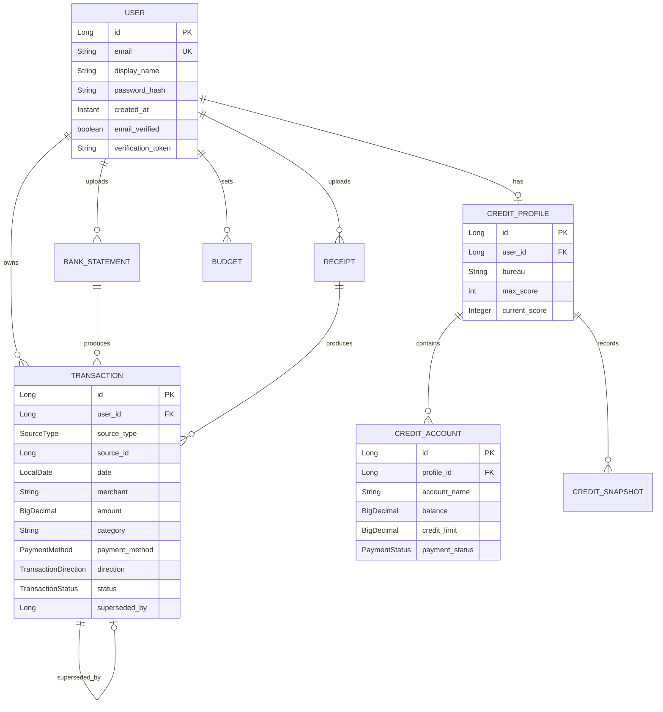

# Database

Azure SQL Serverless in production, file-based H2 locally. Schema is managed by Hibernate
(`ddl-auto=update`) — there is no migration tool in the project.

## Entity relationships



## Transaction

The central table. A few field choices are load-bearing:

**`direction` is stored, not derived.** Statements report debits and credits as separate
columns of positive numbers, so the amount alone cannot say which way money moved — a R18,500
salary and a R18,500 purchase are the same number. Nothing else can recover this.

**`amount` is `DECIMAL(12,2)`.** Never a float. Binary floating point cannot represent decimal
currency exactly, and the errors compound across a sum.

**`category` is free text.** It always was at the entity level; only the extraction prompt
suggests a fixed list. A user correcting a category or naming a budget can use any string.

**`source_type` plus `source_id`** identify origin — `STATEMENT`, `RECEIPT` or `MANUAL` — as a
weak reference rather than a foreign key, since the parent varies by type.

**`superseded_by`** points at the transaction that replaced this one. Duplicates are marked,
never deleted, so the history stays honest.

## Status enums

| Enum | Values | Meaning |
| --- | --- | --- |
| `TransactionStatus` | `ACTIVE`, `SUPERSEDED` | Superseded rows are excluded from every figure |
| `TransactionDirection` | `DEBIT`, `CREDIT` | Which way money moved |
| `PaymentMethod` | `CASH`, `CARD`, `UNKNOWN` | Cash is never matched as a duplicate |
| `SourceType` | `STATEMENT`, `RECEIPT`, `MANUAL` | Where the row came from |
| `StatementStatus` / `ReceiptStatus` | `PROCESSING`, `COMPLETE`, `FAILED` | Polled by the client |

## Ingestion rows

`BankStatement` and `Receipt` are job records, not documents — the uploaded file is never
stored. They carry status, timestamps and `failure_reason`.

`failure_reason` exists because extraction runs in the background. Once the work happens on a
thread nobody is waiting on, a thrown exception has nowhere to go, so the outcome is recorded
on the row. It is the only way the user learns why —
[ADR-004](/decisions/ADR-004-asynchronous-ingestion).

## Credit

`CreditProfile` stores `max_score` per profile rather than as a constant: different bureaux use
different scales, so a hardcoded ceiling would be wrong for some users.

`CreditSnapshot` keeps recorded scores rather than overwriting, so movement over time is
visible.

## Isolation

Every user-scoped table carries `user_id`, and every query filters on the id resolved from the
JWT at the repository call — never in the controller, never in the UI.

## Schema management

`ddl-auto=update` is a deliberate trade-off for a solo project with no production data
migrations yet. It creates and extends the schema but never drops or narrows a column.

::: warning
This does not scale to a team or to data that matters. Introducing Flyway or Liquibase is the
first thing to do if either becomes true.
:::

## Local database

H2, file-based at `backend/data/finme`. Console at <http://localhost:8080/h2-console> (dev
profile only), JDBC URL `jdbc:h2:file:./data/finme`, user `sa`, no password.

Reset it by deleting the directory:

```bash
rm -rf backend/data
```

## Production notes

Azure SQL Serverless auto-pauses when idle and takes 30–60s to resume, so the first request
after a quiet period is slow. `spring.datasource.hikari.initialization-fail-timeout=60000`
makes boot wait for a resume rather than failing context initialisation and cold-restarting.

The dialect is set explicitly so Hibernate needs no live JDBC round-trip to detect it — faster,
deterministic startup, and resilient if the connection is briefly flaky during boot.

See [Environments](/operations/environments) and
[ADR-005](/decisions/ADR-005-azure-sql-over-mysql).
