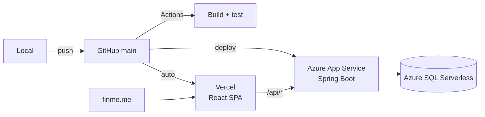

# Deployment

## Topology



| Component | Host | Tier | Cost |
| --- | --- | --- | --- |
| Frontend | Vercel | Hobby | Free |
| Backend | Azure App Service | F1 Free | Free |
| Database | Azure SQL Serverless | GP_S_Gen5, 0.5 vCore min | Near-free at this usage |
| Domain | Namecheap → Vercel DNS | — | Free (student pack) |
| Email | Brevo SMTP | Free tier | Free |

Running on free tiers is a deliberate constraint, not an accident, and it shaped real
decisions — see [ADR-005](/decisions/ADR-005-azure-sql-over-mysql) and
[Troubleshooting](/operations/troubleshooting#slow-first-request) for what it costs in
practice.

## Frontend

Vercel builds from `main` on push. No manual step.

`vercel.json` is required, not optional:

```json
{
  "rewrites": [{ "source": "/(.*)", "destination": "/index.html" }]
}
```

Without it every deep link 404s — `/auth-callback` included, which breaks the entire OAuth
return path. Vercel serves static files and knows nothing of client-side routes unless told.

### Domain

`finme.me` points at Vercel:

| Type | Host | Value |
| --- | --- | --- |
| A | `@` | `76.76.21.21` |
| CNAME | `www` | `cname.vercel-dns.com` |

The domain must also be added in the Vercel project. DNS alone gets a 404 and no certificate —
Vercel's edge needs to know which project answers for the host before it will issue one.

## Backend

```bash
cd backend
./mvnw clean package -DskipTests
az webapp deploy --resource-group finme-rg --name finme-backend \
  --src-path target/backend-0.0.1-SNAPSHOT.jar --type jar
```

Confirm it came up:

```bash
az webapp log tail --name finme-backend --resource-group finme-rg
```

A healthy start logs `Site started successfully`. Startup is roughly 17 seconds.

### Application settings

Set in App Service configuration, never in the repository:

```bash
az webapp config appsettings set --name finme-backend --resource-group finme-rg --settings \
  SPRING_PROFILES_ACTIVE=prod \
  DB_URL="jdbc:sqlserver://...;database=finmedb;encrypt=true" \
  DB_USERNAME=... DB_PASSWORD=... JWT_SECRET=... \
  GROQ_API_KEY=... OPENROUTER_API_KEY=... \
  CLOUDFLARE_ACCOUNT_ID=... CLOUDFLARE_API_TOKEN=... \
  GOOGLE_CLIENT_ID=... GOOGLE_CLIENT_SECRET=... \
  SMTP_USERNAME=... SMTP_PASSWORD=... MAIL_FROM_ADDRESS=... \
  CORS_ALLOWED_ORIGINS="https://finme.me,https://www.finme.me" \
  AUTH_FRONTEND_REDIRECT_URI="https://finme.me/auth-callback" \
  AUTH_FRONTEND_LOGIN_URI="https://finme.me/login"
```

::: warning A settings change may not take effect on its own
Changing app settings is supposed to restart the app. It has not always done so here — the old
values stayed live until an explicit restart. After changing anything, run
`az webapp restart` and verify the new value is actually in effect rather than assuming.
:::

## Google OAuth

In the Google Cloud Console, for the OAuth client:

**Authorised redirect URIs** — the backend, not the frontend:

```
https://finme-backend.azurewebsites.net/login/oauth2/code/google
http://localhost:8080/login/oauth2/code/google
```

**Authorised JavaScript origins:**

```
https://finme.me
```

Publishing the app out of Testing requires a verified domain: the homepage, privacy policy and
terms URLs must be on a domain you own and have verified in Google Search Console. While in
Testing, only allow-listed emails can sign in at all.

Scopes are non-sensitive, so no Google review is needed — only domain verification.

## CI

GitHub Actions on every push and on PRs into `main`. Least privilege: `contents: read`, since
it publishes nothing and deploys nothing. Concurrency cancels superseded runs — on a free
minute budget there is no value finishing a build for a commit nobody will look at again.

## Deployment checklist

1. `./mvnw test` and `npm run test:e2e` green locally
2. CI green on `main`
3. Backend deployed and `Site started successfully` in the logs
4. Frontend auto-deployed by Vercel
5. Verify CORS actually works for the live origin:

```bash
curl -s -i -X OPTIONS "https://finme-backend.azurewebsites.net/api/dashboard/summary" \
  -H "Origin: https://finme.me" \
  -H "Access-Control-Request-Method: GET" | grep -i "^access-control"
```

A `200` alone is not proof — check the returned `Access-Control-Allow-Origin` matches. This
exact check would have caught a production outage where every API call was blocked because the
allowed origin still named an old URL.
