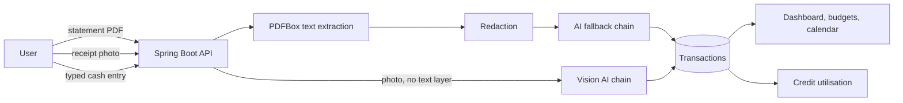

# Overview

FinMe is a personal finance and credit-health tracker. It reads bank statement PDFs and
photographed receipts, extracts the transactions from them, categorises the spending, and
reports credit utilisation against the accounts you record.

## The problem

Tracking spending and credit health across statements, receipts and account information is
tedious and error-prone when done by hand. The consequence is not just effort: it is that
spending patterns go unnoticed, overspending is caught late, and decisions about credit are
made without knowing where utilisation actually sits.

Most finance apps solve the first half by connecting directly to a bank. That is not
available to a solo project without a licensed aggregator, and it does not help with the
paper receipt in your pocket. FinMe works from the documents you already have.

## What makes it more than a CRUD app

The dashboard is the visible part; it is not the interesting one. Three things carry the
actual engineering weight:

**Extraction accuracy is measured, not claimed.** An evaluation harness scores both the PDF
and photo pipelines against a labelled golden set, reporting precision, recall and
hallucination rate. "The AI reads your statement" is a claim; a hallucination rate is a
number. See [Test plan](/development/conventions#testing) and
[ADR-001](/decisions/ADR-001-ai-provider-fallback-chain).

**Sensitive data is redacted before it leaves the system.** Account numbers, ID numbers and
personal names are stripped before any external AI call, independent of provider retention
settings. This is a hard requirement, not a configuration option —
[ADR-002](/decisions/ADR-002-redaction-before-ai-calls).

**Financial figures are computed, never estimated.** Spend totals and credit utilisation are
deterministic code. The AI's role is narration and prioritisation only —
[ADR-003](/decisions/ADR-003-deterministic-financial-math).

## How it fits together

The two ingestion paths differ for a real reason: a photographed receipt has no text layer,
so local extraction is impossible and the image itself must go to a vision-capable model.
That makes the receipt path the only one in the app that sends raw external input to a
provider — a deliberate, documented gap covered in
[ADR-002](/decisions/ADR-002-redaction-before-ai-calls).

## Project phases

**Phase 1 — Personal finance tracker.** Ingestion, extraction, categorisation, dashboard,
notifications and the evaluation harness.

**Phase 2 — Credit module.** Credit accounts, utilisation analysis and an improvement plan,
built inside the same application and user account rather than as a separate system.

Both phases are built. See [Roadmap](/product/roadmap) for what was deliberately left out.

## Scale and intent

Solo project, built as a portfolio piece by a final-year IT student. It is deployed and
publicly usable at <https://finme.me>, running on free and near-free infrastructure — a
constraint that shaped several architectural choices, documented in
[ADR-005](/decisions/ADR-005-azure-sql-over-mysql) and
[Deployment](/operations/deployment).
